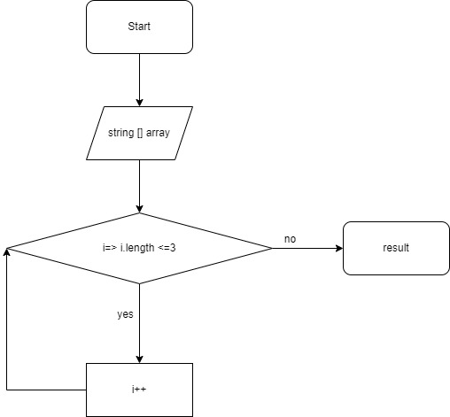

# Описание программы к финальному заданию первого блока обучения

## Этапы

* Задаем массив с помощью команды **string [ ] array**, который позволит нам на начальном этапе ввести массив из строк для выполнения алгоритма.
* задаем переменную **result**, в которой определяем условие, что элемент строки (*в данном случае переменная i* ) должен быть больше или равен длине элементов строк массива, но меньше или равен трем.
* с помощью оператора **string.Join** разделяем полученные данные и выводим их в консоль. 

## Блок-схема

Наглядную блок-схему можно посмотреть на картинке:

